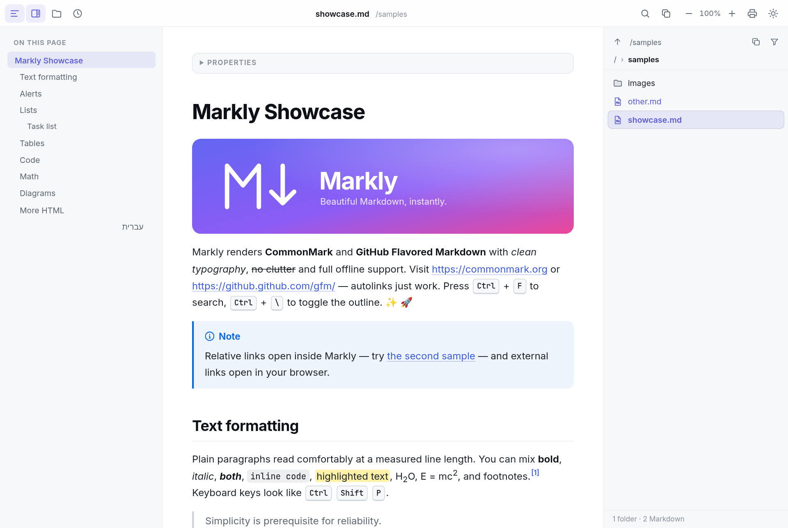

# Markly

A lightweight, beautiful Markdown viewer for Windows, Linux and macOS. Markly is a small native shell
built with [Tauri 2](https://tauri.app) on top of the system web view (WebView2 on Windows, WebKitGTK on
Linux, WKWebView on macOS), so the app itself is only a few MB. It reads files and never edits them, and
it sends no telemetry.





## Download

From the [latest release](../../releases/latest):

| Platform | File |
|---|---|
| Windows 10/11 x64 | `Markly_1.2.0_x64-setup.exe` (installer) or `Markly_1.2.0_x64_portable.exe` |
| Debian / Ubuntu x64 | `Markly_1.2.0_amd64.deb` |
| Fedora / openSUSE x64 | `Markly-1.2.0-1.x86_64.rpm` |
| Any Linux x64 | `Markly_1.2.0_amd64.AppImage` |
| macOS 10.15+ (Intel and Apple silicon) | `Markly_1.2.0_universal.dmg` (unsigned) |

## Features

- CommonMark + GitHub Flavored Markdown: tables (wide ones scroll horizontally), task lists, strikethrough,
  autolinks, footnotes, heading anchors, GitHub alerts (`> [!NOTE]` and friends), `==highlight==`, emoji shortcodes
- Syntax highlighting (40+ languages) with copy buttons
- KaTeX math (`$…$`, `$$…$$`, ```` ```math ````) and Mermaid diagrams. Both load only when a document uses them.
- YAML front matter shown as a collapsible “Properties” panel
- Inter for text and JetBrains Mono for code, all bundled. Works fully offline.
- Light and dark themes that follow the system, plus a toggle (System → Light → Dark)
- Automatic right-to-left layout for Hebrew and Arabic paragraphs
- Table-of-contents sidebar, find, zoom, print / Save as PDF
- Folder browser panel on the right (Ctrl+Shift+E):
  - Shows the document's folder with breadcrumbs, an Up button and a copyable full path.
  - Click a Markdown file to open it. Double-click a folder to go into it.
  - Other files are dimmed and never opened. Hidden files are not shown.
  - Optional *only Markdown* filter, and full keyboard navigation.
  - Resizable, refreshes when the folder changes, and remembers its state.
- Copy button next to Find: **Copy path** copies the file's full path, and **Copy content** copies the raw
  Markdown source exactly as it is on disk, not the rendered page. Ctrl+Shift+C copies the path.
- Opens files from the command line, by double-click or *Open with*, by drag and drop, or with Ctrl+O (⌘O on macOS). Keeps a list of recent files.
- Relative images and links resolve from the document's folder. Links to `.md` files open in Markly
  (Alt+← goes back), and web links open in your default browser.
- Reloads automatically when the file changes on disk and keeps your scroll position
- Remembers window size, position, theme, zoom and sidebar state
- Strips scripts and unsafe HTML from documents, and never launches executables from links

## Keyboard shortcuts

On macOS use ⌘ wherever the table says Ctrl. ⌘[ / ⌘] also go back and forward.

| Action | Keys |
|---|---|
| Open file | Ctrl+O |
| Find / next / previous | Ctrl+F, Enter / F3, Shift+Enter / Shift+F3 |
| Copy file path | Ctrl+Shift+C |
| Folder browser on / off | Ctrl+Shift+E |
| In the folder browser | ↑ ↓ Home End to move, Enter to open, Backspace / Alt+↑ for Up, type to jump, Esc back to the document |
| Table of contents | Ctrl+\ |
| Zoom in / out / reset | Ctrl + = / Ctrl + - / Ctrl + 0, or Ctrl + mouse wheel |
| Print / Save as PDF | Ctrl+P |
| Toggle theme | Ctrl+Shift+L |
| Reload | F5 |
| Back / forward (between linked docs) | Alt+← / Alt+→ or mouse back/forward buttons |
| Close window | Ctrl+W |

## Install

### Windows

Run `Markly_1.2.0_x64-setup.exe`. It installs for the current user only, so no admin prompt.
The installer registers Markly as an **Open with** handler for `.md`, `.markdown`, `.mdown` and `.mkd`. It does
not take over an existing default app. To make Markly the default, right-click a `.md` file and choose
*Open with → Choose another app → Markly → Always*, or use *Settings → Apps → Default apps → Markly*.
If no app was registered for `.md` before, Markly becomes the handler.

There is also a portable option: `Markly_1.2.0_x64_portable.exe` runs without installing, but it
does not register file associations.

The binaries are not code-signed, so Windows SmartScreen may warn you the first time.
Click **More info → Run anyway**.

### Linux

- Debian/Ubuntu: `sudo apt install ./Markly_1.2.0_amd64.deb`
- Fedora/RHEL/openSUSE: `sudo dnf install ./Markly-1.2.0-1.x86_64.rpm` (or `zypper install`)
- AppImage: `chmod +x Markly_1.2.0_amd64.AppImage && ./Markly_1.2.0_amd64.AppImage file.md`.
  It is large (~105 MB) because it bundles WebKitGTK. Prefer the deb/rpm where possible.

The deb and rpm install `markly` to `/usr/bin` and a desktop entry for `text/markdown`, so Markly shows
up under *Open With*. Your desktop keeps any existing default app. To make Markly the default, run
`xdg-mime default Markly.desktop text/markdown`. Needs WebKitGTK 4.1 (`libwebkit2gtk-4.1-0`, which the
packages pull in).

### macOS

Open the `.dmg` and drag Markly to *Applications*. The app is **not signed or notarized**, so the first
launch is blocked by Gatekeeper. Either right-click Markly in *Applications* → **Open** → **Open**, or run:

```bash
xattr -dr com.apple.quarantine /Applications/Markly.app
```

Markly is registered as a viewer for `.md`, `.markdown`, `.mdown` and `.mkd`, as an alternate handler.
It appears under *Open With* without becoming the default. To make it the default, use
*Get Info → Open with → Markly → Change All…*.

## Performance

1.1 renders faster than 1.0, and its output is unchanged: screenshots are pixel-identical in light and
dark, and the rendered HTML is identical. Measured on the same Linux box with the same method for both
versions. Desktop timings come from headless Chrome (`node tools/bench.mjs`): each figure is the median
of 7 cold runs, averaged over 2 interleaved rounds. Memory and size come from the real binaries
(`tools/linux-rss.sh`, Xvfb, 10 s idle).

| Metric | 1.0.0 | 1.1.0 | Change |
|---|---:|---:|---:|
| Start-up JS + CSS | 455 + 46 KB | 247 + 24 KB | −46% |
| Start-up download (gzip) | 169 KB | 98 KB | −42% |
| First render, text-only doc (3,400 words) | 393 ms | 269 ms | −32% |
| First render, `showcase.md` (code, math, diagrams) | 689 ms | 614 ms | −11% |
| `showcase.md` fully ready (math + diagrams drawn) | 1257 ms | 1194 ms | −5% |
| JS heap, text-only / showcase | 2.9 / 15.1 MB | 2.3 / 14.7 MB | −0.6 / −0.4 MB |
| Renderer memory (PSS), text-only / showcase | 77 / 114 MB | 76 / 115 MB | ≈ same |
| Windows installer | 3.49 MiB | 3.41 MiB | −2.5% |
| Windows portable exe | 5.53 MiB | 5.06 MiB | −8.5% |
| Linux binary | 6.80 MiB | 6.41 MiB | −5.7% |
| Linux idle memory, showcase open (app + WebKit processes, PSS) | ~461 MB | ~460 MB | ≈ same |

**1.2.0 vs 1.1.0, with the folder browser closed.** The Copy button and the folder browser don't slow
start-up. Same method, median of 7 runs averaged over 3 interleaved rounds. This was a later session on
a busier machine, so compare numbers within one table, not across tables:

| Metric | 1.1.0 | 1.2.0 |
|---|---:|---:|
| Start-up JS + CSS | 247.1 + 24.1 KB | 249.5 + 25.2 KB |
| Start-up download (gzip) | 98.4 KB | 99.8 KB |
| Requests, text-only / showcase | 8 / 62 | 8 / 62 |
| First render, text-only doc | 290 ms | 294 ms (within noise) |
| First render, `showcase.md` | 671 ms | 670 ms |
| JS heap, text-only / showcase | 2.3 / 14.7 MB | 2.3 / 14.8 MB |

The folder browser's script (9.4 KB) and stylesheet (3.5 KB) load only when the panel is first opened.

Where the 1.1 gains come from:
- The text font is preloaded, and Chromium's default `text-rendering` is used, so the first layout is not
  redone when the font arrives.
- highlight.js loads only the grammars a document uses, the YAML parser loads only for front matter, and
  KaTeX's stylesheet loads only with KaTeX.
- The table of contents is built before the first layout.
- The Rust binary is optimized for size.

## Build

You need Node 20+, Rust (stable) and the Tauri CLI: `cargo install --locked tauri-cli@^2`.

**Windows (on Windows):** `npm install`, then `cargo tauri build`. The output is in `src-tauri/target/release/bundle/nsis/`.

**Windows (cross-compiled from Linux, used for the release builds):**

```bash
rustup target add x86_64-pc-windows-msvc
cargo install --locked cargo-xwin
sudo apt install nsis lld llvm clang    # plus: ln -s clang-cl-19 /usr/local/bin/clang-cl
./build-windows.sh                      # installer + portable exe in dist/
```

**Linux:**

```bash
sudo apt install libwebkit2gtk-4.1-dev libgtk-3-dev librsvg2-dev libayatana-appindicator3-dev patchelf file dpkg-dev
./build-linux.sh                        # .deb, .rpm, .AppImage in dist/
```

**macOS:** `npm install`, then
`rustup target add aarch64-apple-darwin x86_64-apple-darwin && cargo tauri build --target universal-apple-darwin`.

**CI / releases:** `.github/workflows/ci.yml` builds every push and pull request on all three
platforms. Pushing a tag such as `v1.2.0` runs `.github/workflows/release.yml`, which creates a GitHub
release with the Windows installer and portable exe, the Linux deb/rpm/AppImage and the macOS dmg.
To rebuild an existing tag, run `gh workflow run release.yml --ref main -f tag=v1.2.0`. It reuses
that tag's release, whether it is a draft or published, and replaces assets that have the same names.

Frontend only: `npm run build` (writes `dist-web/`). Then:
- `node tools/screenshot.mjs` renders the sample in headless Chrome.
- `node tools/interact.mjs` runs the UI checks.
- `node tools/bench.mjs` measures first-render time and memory.

## Layout

```
src/            frontend (vanilla JS + CSS, bundled by esbuild)
  app.js        UI: loading, TOC, find, zoom, theme, links, shortcuts
  render.js     markdown-it pipeline + DOMPurify + Mermaid
  math.js       $/$$ math plugin, lazy KaTeX
  files.js      folder browser panel (lazy-loaded with files.css)
  host.js       Tauri bridge (or plain-browser fallback for previews)
src-tauri/      Rust shell: file reading, file watching, CLI args, window state
  windows/hooks.nsh   Windows installer file-association hooks
  linux/markly.desktop  Linux desktop entry (deb/rpm/AppImage)
  tauri.{windows,linux,macos}.conf.json  per-platform bundle settings
samples/        showcase documents
tools/          screenshot, interaction test and benchmark scripts
```

## Version history

All releases so far, newest first. See [CHANGELOG.md](CHANGELOG.md) for full details.

### 1.2.0 — 2026-10-08
- **Folder browser** panel on the right (Ctrl+Shift+E):
  - Breadcrumbs, an Up button and the folder path (copyable).
  - Click Markdown files to open them. Other files are dimmed and never launched.
  - The current file is highlighted and followed. Optional only-Markdown filter.
  - Keyboard navigation, resizable, auto-refreshing, and loaded only when first opened.
- **Copy button** next to Find: copy the file's path (Ctrl+Shift+C) or its raw Markdown source.
- Release workflow fixed: installers are attached reliably, and existing tags can be rebuilt.
- macOS release is a universal `.dmg` (Intel and Apple silicon).

### 1.1.0 — 2026-10-08
- **Faster**: the start-up bundle is 46% smaller (501 → 271 KB). First render is 32% faster for
  text-only documents (393 → 269 ms) and 11% faster for the showcase (689 → 614 ms). Output is
  pixel-identical.
- **Linux** (`.deb`, `.rpm`, `.AppImage`) and **macOS** (`.dmg`, unsigned) support, with *Open With*
  registration and Finder double-click handling.
- CI builds for all three platforms, and a tag-triggered release workflow.
- Links to scripts, launchers and installers for macOS and Linux are blocked too, not only Windows ones.

### 1.0.0 — 2026-10-08
- First release: a lightweight Markdown viewer for Windows (Tauri 2 + WebView2).
- GitHub Flavored Markdown, syntax highlighting, KaTeX math, Mermaid diagrams, front matter, RTL text.
- Light/dark themes, table of contents, find, zoom, print / PDF, recent files, auto-reload.
- Sanitized HTML, no launching of executables, per-user installer, *Open with* without taking over `.md`.

## License

[MIT](LICENSE)
