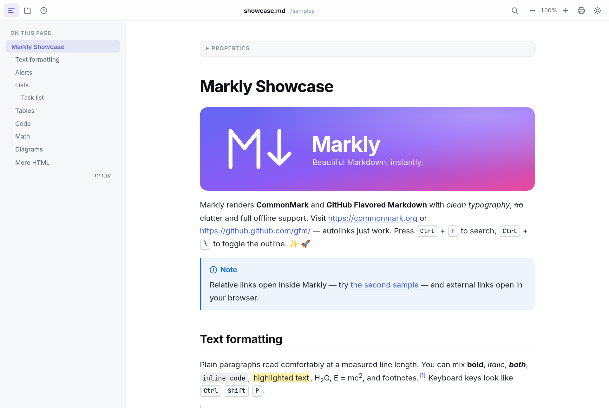
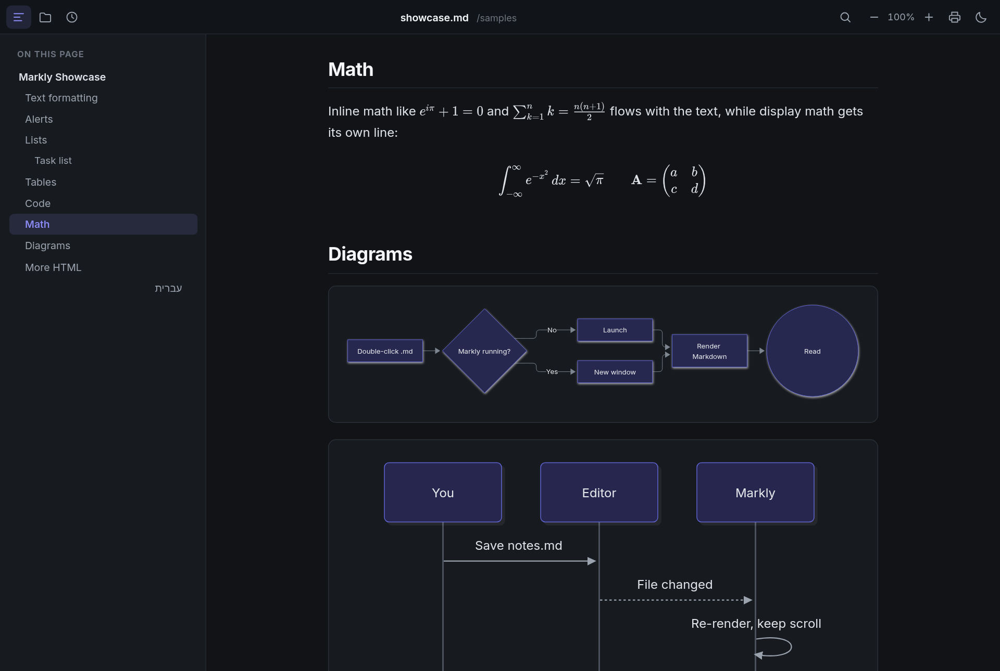

# Markly

A lightweight, beautiful Markdown viewer for Windows. Markly is a small native shell built with
[Tauri 2](https://tauri.app) that uses the WebView2 runtime already included in Windows 10 and 11, so the
app itself is only a few MB. It reads files and never edits them, and it sends no telemetry.




## Download

Grab `Markly_1.0.0_x64-setup.exe` (installer) or `Markly_1.0.0_x64_portable.exe` from the
[latest release](../../releases/latest).

## Features

- CommonMark + GitHub Flavored Markdown: tables (wide ones scroll horizontally), task lists, strikethrough,
  autolinks, footnotes, heading anchors, GitHub alerts (`> [!NOTE]` and friends), `==highlight==`, emoji shortcodes
- Syntax highlighting (40+ languages) with copy buttons
- KaTeX math (`$…$`, `$$…$$`, ```` ```math ````) and Mermaid diagrams. Both load only when a document uses them.
- YAML front matter shown as a collapsible “Properties” panel
- Inter for text and JetBrains Mono for code, all bundled. Works fully offline.
- Light and dark themes that follow Windows, plus a toggle (System → Light → Dark)
- Automatic right-to-left layout for Hebrew and Arabic paragraphs
- Table-of-contents sidebar, Ctrl+F find, zoom, print / Save as PDF
- Opens files from the command line, by double-click or *Open with*, by drag and drop, or with Ctrl+O. Keeps a list of recent files.
- Relative images and links resolve from the document's folder. Links to `.md` files open in Markly
  (Alt+← goes back), and web links open in your default browser.
- Reloads automatically when the file changes on disk and keeps your scroll position
- Remembers window size, position, theme, zoom and sidebar state
- Strips scripts and unsafe HTML from documents, and never launches executables from links

## Keyboard shortcuts

| Action | Keys |
|---|---|
| Open file | Ctrl+O |
| Find / next / previous | Ctrl+F, Enter / F3, Shift+Enter / Shift+F3 |
| Table of contents | Ctrl+\ |
| Zoom in / out / reset | Ctrl + = / Ctrl + - / Ctrl + 0, or Ctrl + mouse wheel |
| Print / Save as PDF | Ctrl+P |
| Toggle theme | Ctrl+Shift+L |
| Reload | F5 |
| Back / forward (between linked docs) | Alt+← / Alt+→ or mouse back/forward buttons |
| Close window | Ctrl+W |

## Install (Windows)

Run `Markly_1.0.0_x64-setup.exe`. It installs for the current user only, so no admin prompt.
The installer registers Markly as an **Open with** handler for `.md`, `.markdown`, `.mdown` and `.mkd`. It does
not take over an existing default app. To make Markly the default, right-click a `.md` file and choose
*Open with → Choose another app → Markly → Always*, or use *Settings → Apps → Default apps → Markly*.
If no app was registered for `.md` before, Markly becomes the handler.

There is also a portable option: `Markly_1.0.0_x64_portable.exe` runs without installing, but it
does not register file associations.

The binaries are not code-signed, so Windows SmartScreen may warn you the first time.
Click **More info → Run anyway**.

## Build

Cross-compile from Linux (used for these builds):

```bash
# one-time setup
rustup target add x86_64-pc-windows-msvc
cargo install --locked cargo-xwin tauri-cli@^2
sudo apt install nsis lld llvm clang    # plus: ln -s clang-cl-19 /usr/local/bin/clang-cl
# build + collect artifacts in dist/
./build-windows.sh
```

On Windows, run `npm install` and then `cd src-tauri && cargo tauri build`.

Frontend only: `npm run build` (writes `dist-web/`). Then `node tools/screenshot.mjs` renders the sample in
headless Chrome, and `node tools/interact.mjs` runs the UI checks.

## Layout

```
src/            frontend (vanilla JS + CSS, bundled by esbuild)
  app.js        UI: loading, TOC, find, zoom, theme, links, shortcuts
  render.js     markdown-it pipeline + DOMPurify + Mermaid
  math.js       $/$$ math plugin, lazy KaTeX
  host.js       Tauri bridge (or plain-browser fallback for previews)
src-tauri/      Rust shell: file reading, file watching, CLI args, window state
  windows/hooks.nsh   installer file-association hooks
samples/        showcase documents
tools/          screenshot / interaction test scripts
```

## License

[MIT](LICENSE)
