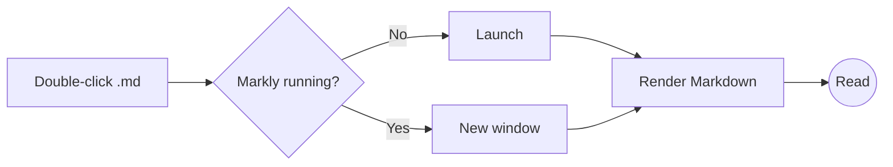
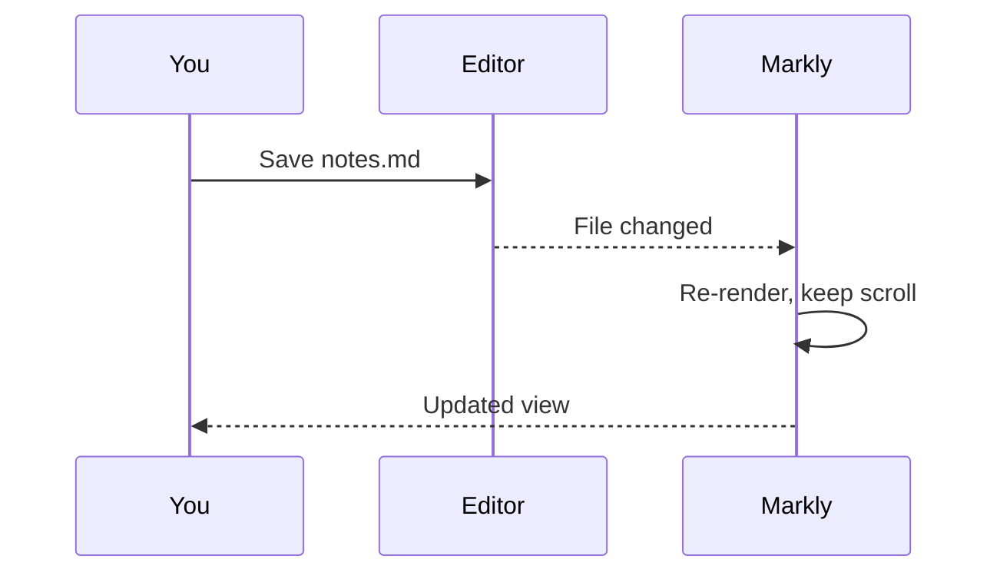

# Markly Showcase


Markly renders **CommonMark** and **GitHub Flavored Markdown** with *clean typography*, ~~no clutter~~ and full offline support. Visit <https://commonmark.org> or https://github.github.com/gfm/ — autolinks just work. Press <kbd>Ctrl</kbd> + <kbd>F</kbd> to search, <kbd>Ctrl</kbd> + <kbd>\\</kbd> to toggle the outline. :sparkles: :rocket:

> [!NOTE]
> Relative links open inside Markly — try [the second sample](other.md#welcome-back) — and external links open in your browser.

## Text formatting

Plain paragraphs read comfortably at a measured line length. You can mix **bold**, *italic*, ***both***, `inline code`, ==highlighted text==, H<sub>2</sub>O, E = mc<sup>2</sup>, and footnotes.[^speed] Keyboard keys look like <kbd>Ctrl</kbd> <kbd>Shift</kbd> <kbd>P</kbd>.

> Simplicity is prerequisite for reliability.
>
> > Nested quotes stay readable, too.
>
> — Edsger W. Dijkstra

## Alerts

> [!TIP]
> Drag any `.md` file onto the window to open it instantly.

> [!IMPORTANT]
> Markly is read-only by design: it never modifies your files.

> [!WARNING]
> Files are watched for changes and re-rendered automatically when saved.

> [!CAUTION]
> Raw HTML is sanitized, so scripts inside documents never run.

## Lists

1. Lightweight — a small native shell around the system WebView2
2. Beautiful
   - Inter for text, JetBrains Mono for code
   - Light and dark themes that follow Windows
3. Offline — every font and script is bundled

### Task list

- [x] Tables with alignment and horizontal scrolling
- [x] Syntax highlighting with copy buttons
- [x] KaTeX math and Mermaid diagrams
- [ ] Take over the world
  - [x] Nested tasks work too

## Tables

| Feature   | Status | Notes                           | Since |
| :-------- | :----: | :------------------------------ | ----: |
| Tables    |   ✅   | GFM pipes, alignment, scrolling |   1.0 |
| Code      |   ✅   | 40+ languages via highlight.js  |   1.0 |
| Math      |   ✅   | KaTeX, loaded on demand         |   1.0 |
| Diagrams  |   ✅   | Mermaid, loaded on demand       |   1.0 |
| Editing   |   ❌   | Viewer only, by design          |     — |

A wide table scrolls horizontally instead of squashing:

| Region | Q1 Revenue | Q2 Revenue | Q3 Revenue | Q4 Revenue | YoY Growth | Gross Margin | Operating Margin | Headcount | Customers | NPS | Churn |
|---|---:|---:|---:|---:|---:|---:|---:|---:|---:|---:|---:|
| North America | $4.2M | $4.6M | $5.1M | $5.9M | 31% | 72% | 18% | 142 | 1,204 | 61 | 2.1% |
| EMEA | $2.8M | $3.0M | $3.3M | $3.8M | 24% | 69% | 14% | 96 | 876 | 58 | 2.6% |
| APAC | $1.1M | $1.4M | $1.8M | $2.2M | 52% | 66% | 9% | 54 | 412 | 64 | 3.0% |

## Code

```typescript
// Debounced file watcher callback
export function debounce<T extends (...args: any[]) => void>(fn: T, ms = 120) {
  let timer: ReturnType<typeof setTimeout> | undefined;
  return (...args: Parameters<T>) => {
    clearTimeout(timer);
    timer = setTimeout(() => fn(...args), ms);
  };
}
```

```rust
#[tauri::command]
fn read_markdown(path: String) -> Result<String, String> {
    std::fs::read_to_string(&path).map_err(|e| format!("Could not open {path}: {e}"))
}
```

```python
from dataclasses import dataclass

@dataclass
class Invoice:
    customer: str
    amount: float
    paid: bool = False

    def overdue(self, days: int) -> bool:
        return not self.paid and days > 30
```

```powershell
Get-ChildItem -Path . -Filter *.md -Recurse | ForEach-Object { & markly.exe $_.FullName }
```

```diff
- const viewer = "heavy IDE";
+ const viewer = "Markly";
```

```json
{ "theme": "system", "zoom": 1.1, "toc": true, "recent": ["notes.md", "README.md"] }
```

## Math

Inline math like $e^{i\pi} + 1 = 0$ and $\sum_{k=1}^{n} k = \frac{n(n+1)}{2}$ flows with the text, while display math gets its own line:

$$
\int_{-\infty}^{\infty} e^{-x^2}\,dx = \sqrt{\pi}
\qquad
\mathbf{A} = \begin{pmatrix} a & b \\ c & d \end{pmatrix}
$$

## Diagrams





## More HTML

<details>
<summary>Click to expand</summary>

Collapsible sections are supported, including **Markdown** inside them.

</details>

## עברית

כיוון הטקסט מזוהה אוטומטית ב-Markly: פסקאות בעברית מוצגות מימין לשמאל, וקוד נשאר משמאל לימין.

- פריט ראשון
- פריט שני

[^speed]: Startup is fast because Markly reuses the WebView2 runtime already installed on Windows 10 and 11.
